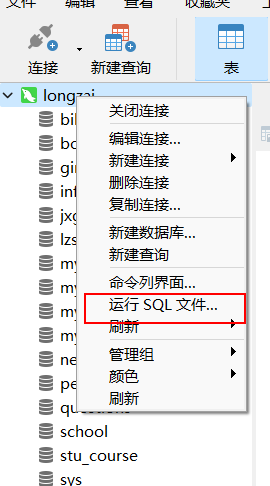

# lz_blog_backend

### 一、创建数据库

通过Navicat 运行项目中的my_blog.sql文件，完成数据库的创建



### 二、配置.env，连接数据库

配置为自己的本地的数据库

```env
APP_PORT = 8000
APP_HOST = http://localhost

MYSQL_HOST = localhost
MYSQL_PORT = 3306
MYSQL_USER = root 
MYSQL_PASSWORD = 123456
MYSQL_DATABASE = my_blog
```

### 三、配置qq服务器，用于发送验证码

可以查看如何开启发送邮箱服务： http://longzai1024.top/article?artId=65

打开qq邮箱的服务以后，将记录下来的授权码和自己的邮箱号码配置到 src/controller/user.control.js文件当中

在verifyCode()方法中需要修改三处，我已在下面代码中进行了标记。

```js
   async verifyCode(ctx, next) {
        const { email } = ctx.request.body;
        console.log(email);
        let transporter = nodemailer.createTransport({
            host: "smtp.qq.com",
            port: 465,
            auth: {
                user: "179***7990@qq.com", // 1. 自己的qq邮箱号
                pass: "wjuxzdbbi", // 2. 自己邮箱的pop3服务器的授权码
            },
        });

        function createCode() {
            let codeArr = [0, 1, 2, 3, 4, 5, 6, 7, 8, 9];
            let length = 6,
                code = "";
            for (let i = 0; i < length; i++) {
                let randomI = Math.floor(Math.random() * 10);
                code += codeArr[randomI];
            }
            return code;
        }

        //实现思路：
        /* 
            1、保存code到数据库
            2、设置定时器，60秒后清除
            3、注册验证，从数据库读取code，验证是否正确
        */
        //保存验证码
        const code = createCode()

        // send mail with defined transport object
        try {
            let info = await transporter.sendMail({
                from: '179***7990@qq.com', //3. 自己的qq邮箱号
                to: email, // list of receivers
                subject: "龙仔博客-验证邮件", // Subject line
                text: "验证码：" + code, // plain text body
            });

            transporter.verify(function(error, success) {
                if (!error) {
                    console.log("发送成功");
                }
            });
        } catch (error) {
            console.error("Email Error:" + error);
            return;
        }

        //用户名已经存在
        try {
            const result = await service.getUserbyName(email);
            if (result.length) {
                await service.updateRcode(email, code)
            } else {
                await service.saveRcode(email, code)
            }
        } catch (error) {
            console.error(error);
        }


        //60秒内有效
        setTimeout(async() => {
            await service.updateRcode(email, null)
        }, 60000);
        ctx.body = {
            msg: '发送成功'
        }
    }
```


### 四、安装依赖，运行项目

安装依赖

`npm install`

运行项目

`npm start`
